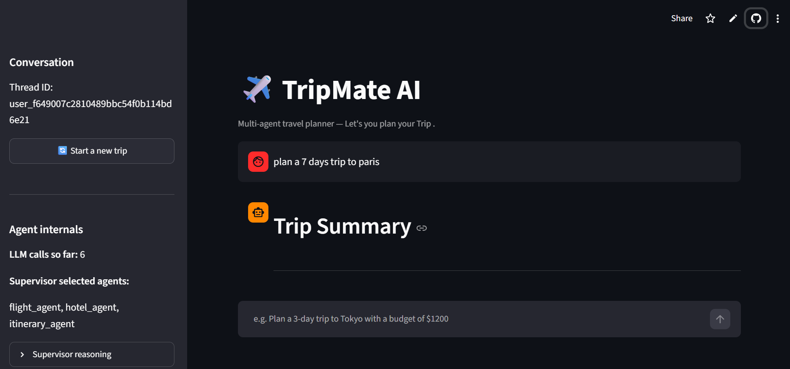

# ✈️ TripMate AI — Multi-Agent Travel Planner

Plan a trip by just talking to it. A Supervisor agent reads your request, routes it to the right specialists — flights, hotels, weather, budget, itinerary — and hands you a draft plan you can approve or send back for revisions, with a human always in the loop before anything is finalized.

**🚀 [Live Demo](https://multi-agent-het2m3hepxzdzy9flwipcn.streamlit.app/)**


---

## What makes it different

Most "AI travel planner" demos are one prompt wrapped around one LLM call. This one is a small team of agents supervised by a router, using real tools over **MCP** — not made-up flight numbers or invented weather.

- 🧭 **Supervisor routing** — only calls the specialists a request actually needs
- 🛡️ **Input guardrail** — filters non-travel or harmful requests before they hit an agent
- ✋ **Human-in-the-loop** — pauses at a draft itinerary and waits for your approval
- 🔌 **Real tools via MCP** — live hotel/web search, flight & airport data, weather
- 💾 **Durable conversations** — Postgres checkpointing survives refreshes and restarts

---

## Screenshots



*Main chat view — supervisor routing and each agent's output shown live in the sidebar*

---

## How it's built

| File | Role |
|---|---|
| `backend.py` | The LangGraph graph — state, supervisor, guardrail, specialist agents, HITL node, Postgres checkpointer |
| `mcp_client.py` | Connects to Tavily, AviationStack (via `uvx`), and a local weather MCP server |
| `custom_weather_mcp_server.py` | Small FastMCP server wrapping the OpenWeather API |
| `streamlit_app.py` | **The main UI.** Calls `backend.py` directly, with live routing + approve/revise flow |
| `app.py` | FastAPI JSON API exposing the same graph for non-Streamlit clients |

---

## Getting started

**Prerequisites:** Python 3.11+, [`uv`](https://docs.astral.sh/uv/) on `PATH`, a reachable Postgres database, and API keys for Groq, Tavily, AviationStack, and OpenWeather.

```bash
python -m venv .venv
source .venv/bin/activate

pip install -r requirements.txt

cp .env.example .env
# fill in DATABASE_URL, GROQ_API_KEY, TAVILY_API_KEY,
# AVIATIONSTACK_API_KEY, OPENWEATHER_API_KEY
```

**Run the UI:**
```bash
streamlit run streamlit_app.py
```
Opens at `http://localhost:8501`.

**Run the JSON API instead:**
```bash
uvicorn app:app --reload --port 8000
```
Docs at `http://127.0.0.1:8000/docs`.

**Docker:**
```bash
docker build -t tripmate-ai .
docker run --env-file .env -p 8501:8501 tripmate-ai
```

---

## API reference (`app.py`)

| Endpoint | Description |
|---|---|
| `POST /api/travel` | Start or continue a thread. `{ "message": "...", "thread_id": "optional" }` |
| `POST /api/travel/approve` | Approve or revise a paused draft. `{ "thread_id": "...", "approved": true\|false, "feedback": "optional" }` |
| `GET /health` | Health check |

---

## Notes

- `backend.py` connects to Postgres at import time, so a missing `DATABASE_URL` fails fast and loudly.
- The guardrail and supervisor both **fail open** on malformed LLM output, defaulting to the full pipeline rather than breaking.
- No automated tests yet — exercise the graph via the UI or API directly.

## Security

Treat any key that's ever appeared in a shared `.env`, screenshot, or commit as compromised — rotate it. Keep secrets in `.env` (already git-ignored) or your host's secrets manager, never in code.

## License

See [`LICENSE`](./LICENSE).
